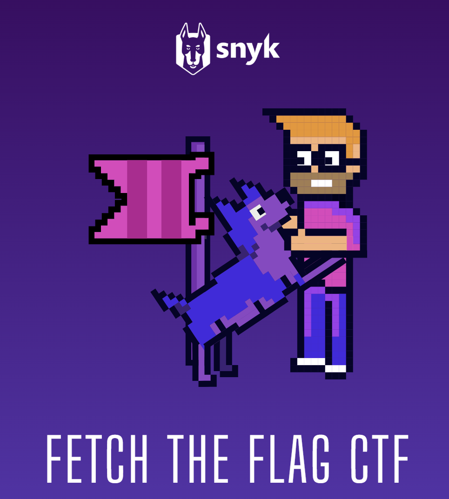

# r4c00nz - tr4shy st0r13s

Exploring cybersecurity, ethical hacking, and digital defense strategies. Trashing systems since '90s.
W1ll h4ck f0r 4 c00k13.🍪🦆

## Articles

### Fetch The Flag 2025

    

**About:**  
[Here](articles/FetchTheFlag2025.md) you can find the writeup from the fetch the flag competition organized by snyk in collaboration with John Hammond.

### oBfsC4t10n2 - HTB - Forensics

    

**About:**  
Hard forensics [challenge](articles/oBfsC4t10n2.md) from hack the box covering Macros embedded in Excel docs.

---

© 2025 r4c00nz Security Blog | Stay secure, stay informed.
