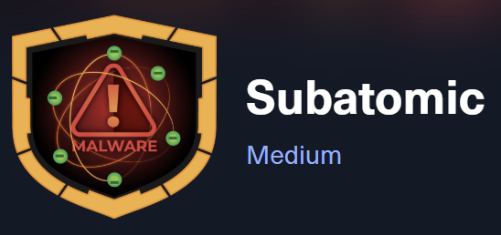

# r4c00nz - tr4shy st0r13s

Exploring cybersecurity, ethical hacking, and digital defense strategies. Trashing systems since '90s.
W1ll h4ck f0r 4 c00k13.🍪🦆

## Articles

### HackTheBox – Subatomic

    

**About:**  
Subatomic is a medium difficulty Sherlock where you are tasked with analysing an electron focused malware sample on behalf of the Forela organisation due to the compromise of a Discord account. You will be tasked with answering questions directly relevant to the analysis of a sample currently found in the wild. Warning: This is a warning that this Sherlock includes software that is going to interact with your computer and files. This software has been intentionally included for educational purposes and is NOT intended to be executed or used otherwise. Always handle such files in isolated, controlled, and secure environments. One the Sherlock zip has been unzipped, you will find a DANGER.txt file. Please read this to proceed.

---

© 2025 r4c00nz Security Blog | Stay secure, stay informed.
