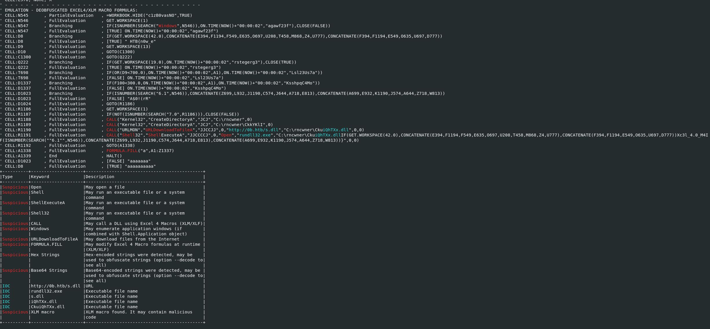

# oBfsC4t10n2

## Category Forensics

## Difficulty Hard

We were given a `.xls` file. That we analysed on the Remnux instance using the `oletools`. Precisely using `olevba`. The output can be seen bellow:

<div style="text-align: center;">
    
</div>

From the start we noticed `HTB{n0w_e`. Then we realized that the flag letters were contained in the excel cells and we had to parse the cells from the `CONCATENATE` functions in order to retrieve the flag. The Flag was stored in this line:

```bash
CALL("Shell32","ShellExecuteA","JJCCCCJ",0,"Open","rundll32.exe","C:\rncwner\CkuiQhTXx.dllIF(GET.WORKSPACE(42.0),CONCATENATE(E394,F1194,F549,E635,O697,U208,T458,M868,Z4,U777),CONCATENATE(F394,F1194,E549,O635,U697,D777))Xc3l_4.0_M4IF(ISNUMBER(SEARCH(""6.1"",N546)),CONCATENATE(Z699,L932,J1190,C574,J644,A718,E813),CONCATENATE(A699,E932,K1190,J574,A644,Z718,W813))}",0,0)
```

We have to parse the cases were the `IF` conditions were true, namely:

```bash
CONCATENATE(E394,F1194,F549,E635,O697,U208,T458,M868,Z4,U777) + Xc3l_4.0_M4 + CONCATENATE(Z699,L932,J1190,C574,J644,A718,E813) + }
```

We can use `grep` to search for the values and rebuild the flag.

Answer: `HTB{n0w_e... SNIP ...}`